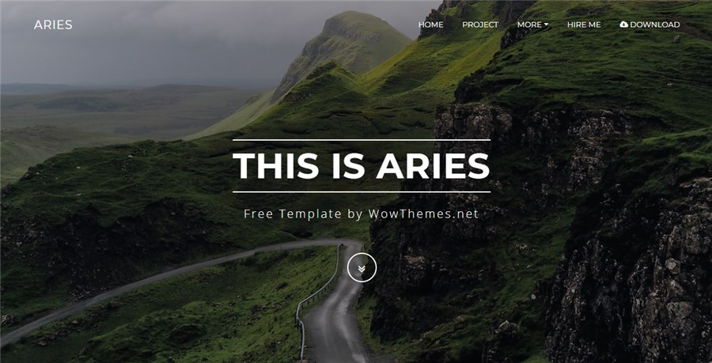

# Template Aries Bootstrap HTML

[Live Demo](https://wowthemesnet.github.io/template-aries-bootstrap-html/) | [Download & Documentation](https://bootstrapstarter.com/bootstrap-templates/template-aries-bootstrap-html/)

Aries is a [Bootstrap](https://getbootstrap.com/) template designed and developed by [WowThemesNet](https://www.wowthemes.net/) and distributed by [Bootstrap Starter](https://bootstrapstarter.com/). The theme is built with Sass, concatenation, minification, autoprefixer, Browsersync, hot reloading and sourcemaps all runned by [Gulp](https://gulpjs.com/). A great Bootstrap starter template for both, beginnners and developers.

